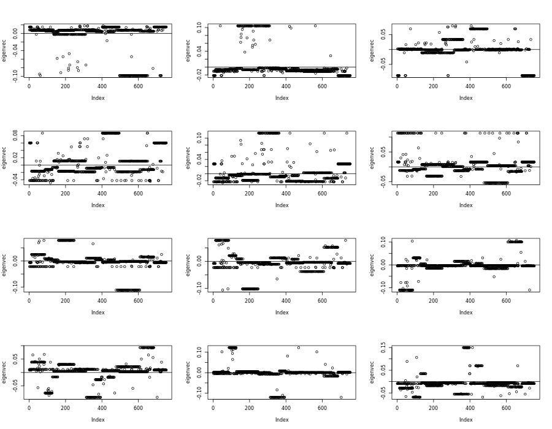
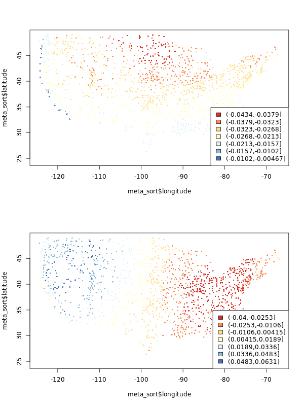

# Linear Model Selection

## Regression requires more data than features

```{r}
library(glmnet)
```

import the dataset

```{r}
df <- read.csv("Datasets/non_retweets_dc_inaug_steal.csv")
```

Down-sampling for faster processing

```{r}
samp_ind <- sample(nrow(df), 8000)
df <- df[samp_ind,]
```

Combining the different flags

```{r}
steal_index <- grep("steai", names(df))
names(df)[steal_index]
df[, "X.stopthesteai2020"] <- (
  df[, "X.stopthesteai2020"] +
    df[, "X.stopthesteai"] +
    df[, "X.stopthesteai2021"])

df <- df[, -grep("(X.stopthesteai$|X.stopthesteai2021$)", names(df))]
```

Removing features that are not numeric

```{r}
text <- df[, grep("tweet_body", names(df))]
df <- df[,-grep("(tweet_body|created_at)", names(df))]
names(df)[grep("_", names(df))]
head(df$created_at)
df <- df[, sapply(df, class) == "numeric"]
```

Fitting the model

```{r}
y_ind <- grep("X.stopthesteai2020", names(df))
x <- as.matrix(df[, -y_ind])
x <- scale(x)
y <- as.numeric(df[, y_ind])
#bad_data <- which(is.na(x[, colnames(x) == "xinaugur"]))
bad_data <- which(is.na(x[, colnames(x) == "zone"]))
x <- x[-bad_data,]
y <- y[-bad_data]

```

```{r}

table(sapply(df,class))

names(df)[sapply(df,class) == "character"]

sum(apply(x,2, function(x) mean(is.na(x) > 0)))
```

Examine the data

```{r}
head(x[,colnames(x)=="zone"])

tail(x[,colnames(x)=="zone"])

head(y)
```

Run the model

```{r}
ols <- lm(y ~ x)
ols_coeffs <- summary(ols)$coefficients

```

To do data mining with p-values, do not treat them like probabilities, but you can use them as a metric to guide you.

```{r}

length(ols$coefficients)
```

```{r}
p_ord <- order(ols_coeffs[, 4])
rownames(ols_coeffs)[head(p_ord, 10)]
```

## Lasso

```{r}
lasso_cv <- cv.glmnet(x,
                      y,
                      alpha=1,
                      nfolds = 5,
                      intercept=TRUE)

plot(lasso_cv)
abline(v=log(lasso_cv$lambda.min),
       col="blue")
abline(v=log(lasso_cv$lambda.1se),
       col="green")
```

```{r}
lasso.fits <- lasso_cv$glmnet.fit
lasso_cv$lambda[which.min(lasso_cv$cvm)]
lasso_cv$lambda.min
lambda_ind <- which.min(lasso_cv$cvm)
plot(
  ols$coefficients[-1],
  lasso_cv$glmnet.fit$beta[, lambda_ind],
  xlab = "OLS Coeffs",
  ylab = "LASSO Coeffs",
  xlim = c(-.1, 0.1),
  ylim = c(-.05, 0.05)
)
abline(h = 0)
abline(a = 0, b = 1)
```

```{r}
lasso_coeffs <- lasso_cv$glmnet.fit$beta[, lambda_ind]
lasso_coeffs[abs(lasso_coeffs) > 0.05]

hist(lasso_cv$glmnet.fit$beta[, lambda_ind])

```

## simulating collinearity + sparsity

```{r}
sample_size <- 1000
p <- 100
useful_p <- 50

# number of corr features
collin_p <- 50
useful_ind <- sample(p, useful_p)
corr_ind <- sample(p, collin_p)

# independent variables
z <- rnorm(sample_size)
corrs <- rep(0, p)
corrs[corr_ind] <- runif(collin_p, 0.3, 0.9)
x <- sapply(corrs,
            function(corr) corr * z + (1 - corr) * rnorm(sample_size))

noise <- rnorm(sample_size)

#first option: generate y according to z
#y <- 2 * z + noise

#second option create a beta that defaults to beta (useless) and for some unknown 
#locations of beta, assign random useful coefficients. 
beta <- rep(0, p)
beta[useful_ind] <- runif(useful_p, -1.2, 1.2)

#matrix multiplication to get Y: most beta is zero and then add noise on top
y <- x %*% beta + noise

ols <- lm(y ~ x)
ols_summ <- summary(ols)$coefficients

rownames(ols_summ)[ols_summ[,4] < 0.05]
length(rownames(ols_summ)[ols_summ[,4]<0.05])


cols <- rep('black', p)
cols[corr_ind] <- "red"
pchs <- rep(1, p)
pchs[useful_ind] <- 16
plot(ols$coefficients[-1], beta,
     pch=pchs, col=cols)
abline(a=0, b=1)
```

## Demo on glmnet functionalities

```{r}
library(glmnet)
lasso_cv <- cv.glmnet(cbind(x, y), y, alpha=1)
coef(lasso_cv)
lasso_mod <- glmnet(x, y, alpha=1, lambda=lasso_cv$lambda.1se)
coef(lasso_mod)
```

```{r}
sample_size <- 1000
p <- 100
useful_p <- 50
# number of corr features
collin_p <- 50
useful_ind <- sample(p, useful_p)
corr_ind <- sample(p, collin_p)

# independent variables
z <- rnorm(sample_size)
corrs <- rep(0, p)
corrs[corr_ind] <- runif(collin_p, 0.3, 0.9)
x <- sapply(corrs,
            function(corr) corr * z + (1 - corr) * rnorm(sample_size))

noise <- rnorm(sample_size)
# y <- 2 * z + noise
beta <- rep(0, p)
beta[useful_ind] <- runif(useful_p, -1.2, 1.2)
y <- x %*% beta + noise


sim_num <- 100

beta_mse <- matrix(NA, ncol=3, nrow=sim_num)
z_coeffs <- matrix(NA, ncol=3, nrow=sim_num)
for(i in seq_len(sim_num)){
  if(i %% 10 == 0){
    print(i)
  }
  noise <- rnorm(sample_size)
  # y <- 2 * z + noise
  y <- x %*% beta + noise

  ols <- lm(y ~ x)
  lasso_cv <- cv.glmnet(x, y, alpha=1)
  ridge_cv <- cv.glmnet(x, y, alpha=0)
  beta_mse[i, 1] <- mean((beta - ols$coefficients[-1])^2)
  beta_mse[i, 2] <- mean((beta - coef(lasso_cv)[-1])^2)
  beta_mse[i, 3] <- mean((beta - coef(ridge_cv)[-1])^2)
}

boxplot(beta_mse)
abline(h=2)

plot(lasso_cv)
```

```{r}
sim_num <- 100

z_coeffs <- matrix(NA, ncol=3, nrow=sim_num)
for(i in seq_len(sim_num)){
  if(i %% 10 == 0){
    print(i)
  }
  noise <- rnorm(sample_size)
  y <- 2 * z + noise
  #y <- x %*%
  
  ols <- lm(y ~ x + z)
  lasso_cv <- cv.glmnet(x, y, alpha=1)
  ridge_cv <- cv.glmnet(x, y, alpha=0)
  #z_coeffs[i, 1] <- tail(ols$coefficients, 1)
  #z_coeffs[i, 2] <- tail(coef(lasso_cv), 1)[1, 1]
  #z_coeffs[i, 3] <- tail(coef(ridge_cv), 1)[1, 1]
  
  #if we aren't using z, maybe we should look at prediction accuracy
  
  #you could also use y according to the beta value instead
  #beta_mse[i,1] <- mean((beta - ols$coefficients[-1])^2) #drops the intercept term
}


#boxplot(z_coeffs)
#abline(h=2)
```

## Principal Component Analysis

Sparcity:

Inbalanced data:

### Principle Component Analysis

```{r}

hidden_p <- 5
observ_p <- 30
prob <- NULL # runif(hidden_p)
h2o <- sample(hidden_p,   #hidden to observed
              observ_p,
              replace=TRUE,
              prob=prob)
h2o <- sort(h2o)
sample_size <- 1000
hidden_z <- sapply(
  seq_len(hidden_p),
  function(x) rnorm(sample_size))
corrs <- runif(observ_p, 0.3, 0.8)

#create five groups of colinear stuff
observ_x <- mapply(
  function(i, corr) {
  hidden_z[, i] * corr + rnorm(sample_size) * (1 - corr) *100
    },
  h2o, corrs)

#observ_x is what you often see, but there is still hidden stuff

image(cor(observ_x))

#This looks weird to what we expect. It doesn't look like five groups
#if we sort instead it works


h2o <- sample(hidden_p,   #hidden to observed
              observ_p,
              replace=TRUE,
              prob=prob)

sample_size <- 1000
hidden_z <- sapply(
  seq_len(hidden_p),
  function(x) rnorm(sample_size))

#This effects how things are correlated!
corrs <- runif(observ_p, 0.3, 0.8)

#create five groups of colinear stuff
observ_x <- mapply(
  function(i, corr) {
  hidden_z[, i] * corr + rnorm(sample_size) * (1 - corr)
    },
  h2o, corrs)

#observ_x is what you often see, but there is still hidden stuff

image(cor(observ_x))


```

```{r}

beta <- runif(hidden_p, -10, 10)
noise <- rnorm(sample_size, sd=10)
#hard to measure hidden forces!
#we can only measure x, but x is only correlated to hidden stuff
y <- hidden_z %*% beta + noise
df <- data.frame(y, observ_x)

#y depends on the hidden stuff not x

```

Maybe there is a hidden gene inside of you that makes you sick. We can't (yet) measure that hidden gene. But we can measure symptoms and things like your heart rate. This should be correlated.

## Typical machine learning approach

```{r}
#training data set, first 800 points (80 percent)
train <- 1:800

ols <- lm(y ~ ., df, subset=train)
length(ols$residual) #correct length

#predict on points we didn't use to train
ols_pred <- predict(ols, df[-train,])

#error: differrence between measured values against predict. Mean of this squared MSE!
mean((df$y[-train] - ols_pred)^2)

#run ols 

#PCA TIME
#only input X, (feature matrix) into the PCA function
pr_out <- prcomp(observ_x, scale=FALSE)

#scale is used because Xs might not be in the same unit, so mean = 0, sd = 1
class(pr_out)

#it has its own class
names(pr_out)

#squared value of sdev is eigenvalue
eigen_val <- pr_out$sdev^2 

#cumulative sum as a fraction of total eigenvalues
plot(cumsum(eigen_val) / sum(eigen_val))
abline(h=.9)
#here after the 5th point, the slope tapers off! This is directly related to the hidden_p value at the beginning. It should help show you how many important hidden features there are. 

#it is the percent of variabilitiy caputured by the first k components

#If you don't know what to choose, 90% variability is a good point 


plot(pr_out$sdev)
#Very similar, but not as interpretable as percent of variability. 

#These steps is how k is chosen.

#K is the dimension of W. Data came n x p. We need to shrink it to k. If you don't have
#a clear cut, use 90%

#we don't want to keep all the variability because not all features provide useful
#information. Some of them are so colinear, they just add noise. 

cutoff <- 5

#now we are looking at x

#only pull out first k columns

dim(pr_out$x)
dim(observ_x)
#these will be the same, but we choose a cutoff. 


W <- pr_out$x[, 1:cutoff]
df_w <- data.frame(y, W)


#PCA doesn't have to be lm. It could be ridge or lasso too
#should be like the ols from above
pca <- lm(y ~ ., df_w, subset=train)
#same prediction
pca_pred <- predict(pca, df_w[-train,])

#prediction error
mean((df_w$y[-train] - pca_pred)^2)

#that was the classic view of PCA 
```

## What we would do in data mining

```{r}
k <- 3
plot(pr_out$rotation[,k])
abline(h = 0)
which(abs(pr_out$rotation[, k]) > 0.2)

#what is the truth we should be comparing to?

pr_out <- prcomp(observ_x)


test_x <- scale(observ_x, scale = FALSE) %*%
pr_out$rotation
pr_out$x

#Now looking at rotation

head(observ_x, 1 ) %*% pr_out$rotation[,1]


#k is which column are we going to examine

j <- 2
plot(pr_out$rotation[, j])
abline(h = 0)
which(abs(pr_out$rotation[, j]) > 0.2)
# what is the truth we should be comparing to?


#What is rotation. Matrix (30 x 30 in this case)
dim(pr_out$rotation)
#it is actually p x p rather than p x k to give you more columns

head(pr_out$rotation[,k])
#kth eigenvector which correspods with the kth largest value (most significant) value


#this will always be 1. Property of rotation matrix
sum(pr_out$rotation[,k]^2)


```

## Principal Component Analysis Applied!

### Other example

In really poor countries it is super hard to measure wealth and income. There are no reciepts and corresponding taxes. People don't have bank accounts. Instead, you measure features. Like do you have a fridge. Do you have cooking equipment? How many kids? How many room in your house?

So you could run PCA on assets matrix. You can find correlations. If you have more rooms in your house, you likely have more education. The correlations will be baked into the principal driving component. Further, they use this as the Y to see if they can predict! But that is beyond the scope of this class.

```{r}
library(jsonlite)

#citation count between his 15 papers and those he sighted
citations <- read.csv("Datasets/j_cunningham_citation.csv", head = FALSE)

titles <- read_json("Datasets/j_cunningham_citation_titles.json")
```

### Explore the data

```{r}
dim(citations)

head(citations)
citations[1:5,1:5]
max(citations)

#across all paers
apply(citations, 1, max)

```

```{r}
names(titles)

```

Papers that he has written:

```{r}
head(titles[["auth_titles"]],3)
```

Papers he has cited

```{r}
head(titles[["ref_titles"]],3)
```

Among the 15, there are four papers that reference the 2 most popular articles. Let us find them:

```{r}
ref_count <- apply(citations, 2, function(x) 
sum(x > 0))

targets <- tail(names(sort(ref_count)),2)

#These are the two columns we want
target_ind <- which(names(citations) %in% targets)

target_ind

titles[["ref_titles"]][target_ind]
```

Explore this data: we know the index of the two. This can show the correlation between the two, meaning the papers are cited by certain papers. This would make sense. If you cite one of these, you almost certainly have to cite the other:

```{r}
citations[,target_ind]
```

A few things to remember. Longer papers should have more citations. There is also likely to be correlation between certain papers.

We would intuitively just want to apply our "prcomp", like we learned in last class.

```{r}
pr_out <- prcomp(citations)
plot(pr_out$sdev, main="")
```

This plot is not very appealing. There is not a significant drop until the last term. Maybe between 1 and 2 and 3 and 4, but not a big drop. And if you only abandon 1 dimension, (14 instead of 15), you aren't really saving a lot.

#### Try standardizing the citation matrix in different ways

##### Usual standardization, i.e. make each feature mean=0 and sd = 1

```{r}
norm_citation <- apply(citations, 2 , scale)
#also

pr_out <- prcomp(norm_citation)

plot(pr_out$sdev, main="")

png("Datasets/loadings_normal_standardization.png", 900, 700)
par(mfrow=c(4, 3))
for(i in seq_len(ncol(pr_out$rotation[,1:12]))){
    eigenvec <- pr_out$rotation[, i]
    plot(eigenvec, main = paste("Eigenvec",i))
    abline(h=0)
}
dev.off()

```



Remember from the plot, if we square all the values and add them together they will equal one. So strong deviations will be papers that are relied on (by index). Too many papers that share the same weight, might not be helpful. We believe there are only a few really good papers that we want. Not like 50. So this behavior is still undesirable.

This is bad! You subtract something away from 0 values. But we like 0s because they don't affect the objective function. PCA is using the "frebenious norm" where everything squared and added together is 1. So we like 0s. So how can we scale differently, but while keeping the 0s.

##### Max normalized, i.e. make each feature min=0, max = 1

```{r}
#lets divide by the max, then everything is between 0 and one
norm_citation <- apply(citations, 2,
                       function(x) x / max(x))

pr_out <- prcomp(norm_citation, center=FALSE,
                 scale=FALSE)

png("Datasets/max_normalized.png", 900, 700)
par(mfrow=c(4, 3))
for(i in seq_len(ncol(pr_out$rotation[,1:12]))){
    eigenvec <- pr_out$rotation[, i]
    plot(eigenvec, main = paste("Eigenvec",i))
    abline(h=0)
}

#dev.off()
```

This should look much nicer. For example, Eigvec 4 looks better. Why did we normalize the columns? We often do this because the columns have different units. However, in this, the columns all have the same units. Instead, papers have different lengths, so the citation number can be affected by the length of the paper. So whay do we want to actually normalize? The rows!

##### Max normalized per paper, i.e. make each ROW min=0, max = 1

```{r}
citations_norm_papers <-  apply(citations, 1,
                       function(x) x / max(x))


# Just doing the above actually swapped things! We have 15 columns instead
#It processes a row, and then stacks it as a column. So we need to transpose
citations_norm_papers <- t(citations_norm_papers)


pr_out <- prcomp(citations_norm_papers)

plot(pr_out$sdev, main="")
png("Datasets/loadings_norm_per_paper.png", 900, 700)
par(mfrow=c(4, 3))
for(i in seq_len(ncol(pr_out$rotation[,1:12]))){
    eigenvec <- pr_out$rotation[, i]
    plot(eigenvec)
    abline(h=0)
}
#dev.off()

```

Ther is a much more noticable drop between 11 and 12

```{r}
pr_out <- prcomp(citations)
plot(pr_out$sdev, main="")
png("Datasets/loadings.png", 900, 700)
par(mfrow=c(4, 3))
for(i in seq_len(ncol(pr_out$rotation[,1:12]))){
    eigenvec <- pr_out$rotation[, i]
    plot(eigenvec)
    abline(h=0)
}
#dev.off()

target_ind <- which(abs(pr_out$rotation[, 2]) > 0.15)
titles[["ref_titles"]][target_ind]
```

1st column second row is

2nd column 3rd row is a disaster.

## PCA on weather data example

-   Wrap up the citation problem
-   Play with weather data, tmax, celsius

```{r}
df <- read.csv("Datasets/ushcn.csv")
station <- read.csv("Datasets/station_metadata.csv")
rownames(station) <- station$id
meta_sort <- station[names(df)[-1], c("longitude", "latitude")]

prop_na <- apply(df[, -1], 1,
                 function(x) mean(is.na(x)))

sdf <- df[prop_na < 0.1, ]
sdf_sans_na <- apply(sdf[, -1], 2, function(x){
  x[is.na(x)] <- mean(x, na.rm=TRUE)
  return(x)
})

library(RColorBrewer)
cols <- brewer.pal(7, "RdYlBu")

pr_out <- prcomp(sdf_sans_na)
png("Pictures/no_norm_pca.png", 600, 800)
par(mfrow=c(2, 1))
for(i in 1:2){
  eigvec <- pr_out$rotation[, i]
  breaks <- seq(min(eigvec), max(eigvec), length.out=length(cols)+1)
  col_factors <- cut(eigvec, breaks=breaks)
  plot(meta_sort$longitude,
       meta_sort$latitude,
       col=cols[col_factors],
       pch=16, cex=0.5)
  legend("bottomright",
         legend = levels(col_factors),
         fill=cols)
}
#dev.off()

```



The two are telling in very different ways. The first shows the relationships of the coasts. The second shows east versus west. This is with default normalization: centering, but not scaling.

## Different noramlizations

Run PCA with 3 different types of normalization on the maximum temperature data, then plot the "maps" of the loading values corresponding to the first 2 eigenvectors.

-   No normalization, i.e. no centering and no scaling
-   Centering but no scaling
-   Centering and scaling

Write out what do you observe.

### No normalization

```{r}
prop_na <- apply(df[, -1], 1,
                 function(x) mean(is.na(x)))

sdf <- df[prop_na < 0.1, ]
sdf_sans_na <- apply(sdf[, -1], 2, function(x){
  x[is.na(x)] <- mean(x, na.rm=TRUE)
  return(x)
})

cols <- brewer.pal(7, "RdYlBu")

pr_out <- prcomp(sdf_sans_na, scale = FALSE, center = FALSE)
png("Pictures/no_standardization_pca.png", 600, 800)
par(mfrow=c(2, 1))
for(i in 1:2){
  eigvec <- pr_out$rotation[, i]
  breaks <- seq(min(eigvec), max(eigvec), length.out=length(cols)+1)
  col_factors <- cut(eigvec, breaks=breaks)
  plot(meta_sort$longitude,
       meta_sort$latitude,
       col=cols[col_factors],
       pch=16, cex=0.5)
  legend("bottomright",
         legend = levels(col_factors),
         fill=cols)
}
#dev.off()

```

### Centering and scaling

```{r}
prop_na <- apply(df[, -1], 1,
                 function(x) mean(is.na(x)))

sdf <- df[prop_na < 0.1, ]
sdf_sans_na <- apply(sdf[, -1], 2, function(x){
  x[is.na(x)] <- mean(x, na.rm=TRUE)
  return(x)
})

library(RColorBrewer)

pr_out <- prcomp(sdf_sans_na, center = TRUE, scale = TRUE)
png("Pictures/centering_and_scaling_pca.png", 600, 800)
par(mfrow=c(2, 1))
for(i in 1:2){
  eigvec <- pr_out$rotation[, i]
  breaks <- seq(min(eigvec), max(eigvec), length.out=length(cols)+1)
  col_factors <- cut(eigvec, breaks=breaks)
  plot(meta_sort$longitude,
       meta_sort$latitude,
       col=cols[col_factors],
       pch=16, cex=0.5)
  legend("bottomright",
         legend = levels(col_factors),
         fill=cols)
}
#dev.off()

```

Scaling is super common. When you have different units you always usually scale. However, sometimes, with things like weather data, you might not have to. PCA is trying to find a very consice, uncorrelated description of your data. If things are close to 0, they won't effect.

Subset out the last 144 rows for testing, then pick one station to be our Y and the other stations to be our X.

-   Run PCA on the X values, then fit an OLS
-   Run OLS but only use the closest station (don't bother with projecting, assuming Long/Lat are equidistance for now) as your X.

Which one will do best?

(if you have time, try Lasso with all of the data, this may take awhile....don't do this unless you have time)

```{r}
#Takes last 144 for testing
train <- 1:(nrow(sdf_sans_na) - 144)

# Samples and individual X to be the Y point
y_ind <- sample(ncol(sdf_sans_na), 1)


y_train <- sdf_sans_na[train, y_ind]

x_train <- sdf_sans_na[train, -y_ind]

pr_out <- prcomp(x_train, center = TRUE, scale = FALSE)

ols <- lm(y_train ~ x_train)

library(tidyverse)

station_new <- station %>% 
  mutate(long_difference = longitude - station$longitude[y_ind]) %>% 
  mutate(lat_difference = latitude - station$latitude[y_ind]) %>% 
  select(latitude, longitude, long_difference, lat_difference) %>% 
  mutate(sum_lat_long = lat_difference + long_difference) #%>% 
  #order(decreasing = TRUE, sum_lat_long)
  

station_new
 
#closest <- which(min(station$longitude + station$latitude))


```
